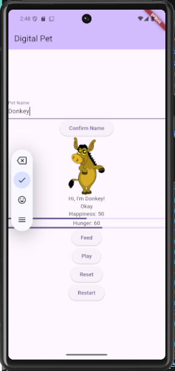
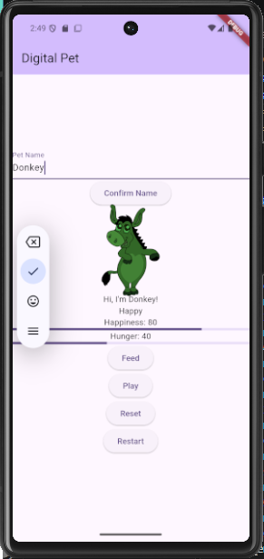

# Digital Pet- Activity 7

## Setup

//bash
flutter pub get
flutter run
//

## Build

//bash
flutter build apk --release
//

## Test

//bash
flutter analyze
flutter test
//

Manual testing covered:

* Feed at hunger 5 and 95
* Play at happiness 95
* Happiness at 29, 30, 70, and 71
* Happiness above 80 for 3 minutes
* Hunger 95 → 100 → overflow tick
* Game over at hunger 100 and happiness ≤10
* Reset and restart
* Timer lifecycle
* Reduced-motion behavior

## Pathway

Undergraduate

## Selected Advanced Features

* Session Controls
* Visual Polish & Accessible Motion

## Team roles

Team 1: Care Systems

* Pet state
* Feed and play
* Hunger timer
* Win/loss conditions
* Reset

Team 2: Pet Personality

* Mood tint and scale
* Animated messages
* Animated meters
* Reduced-motion support
* Restart session

## Learning Outcomes

### Session Controls

Timer and session state are safely reset and restarted.

### Visual Polish & Accessible Motion (implementation)

* Pet scale and tint respond to happiness.
* Messages transition when pet state changes.
* Meters animate to their current values.
* Reduced-motion settings are supported.

## Screenshots

### Main Screen 

### Happy State

### Game Over

## Asset Attribution

Donkey - mirys (CC0 (Public Domain)), via Clipart.Free

## GitHub: 

Repository:
https://github.com/laprexious/inclass-07-digital-pet.git

Team 2 Pull Request:
[(https://github.com/laprexious/inclass-07-digital-pet/pull/1#issue-5687184932)]

## Team Roles

- SOLO PROJECT

## Test Evidence
used: 
`flutter analyze` completed with no issues.

Manual boundary and outcome tests were completed as well and expected outcomes were present.

